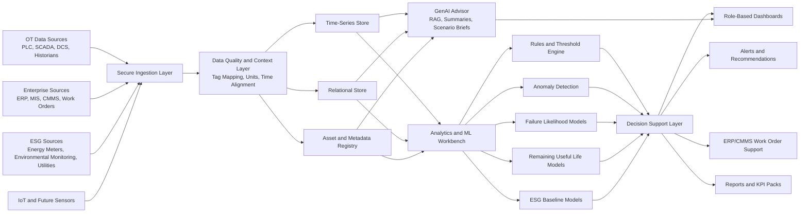

# Enterprise Architecture

## Purpose

This document defines the target enterprise architecture for the Morupule Predictive Intelligence Platform. It is written for proposal, solution design, and stakeholder alignment. The PoC currently demonstrates the experience layer using real public datasets transformed into a proxy-mapped semantic model; the enterprise architecture describes how the same concept scales into an MCM-approved production deployment.

## Architecture Principles

- **OT-safe by design:** no direct write-back to operational control systems unless explicitly approved through MCM change control.
- **Open integration:** support SCADA, PLC/DCS, historians, ERP, MIS, environmental systems, power meters, and future IoT devices.
- **Scalable by asset and tag volume:** grow from pilot assets to full-mine deployment without redesign.
- **Hybrid analytics:** combine engineering rules, reliability thresholds, anomaly detection, and machine-learning models.
- **Explainable decisions:** every alert should show why it fired, what changed, and what action is recommended.
- **Governed models:** versioning, validation, drift monitoring, retraining cadence, and approval workflow.
- **Security and auditability:** role-based access, audit logs, secure remote access, backup, restore, and disaster recovery.
- **GenAI with guardrails:** GenAI can explain, summarize, draft, search, and advise, but cannot directly control equipment or bypass approved maintenance workflows.

## Logical Architecture

## Enterprise Layers

### 1. Source Systems

Production deployment should integrate with MCM-approved systems, including:

- PLC, SCADA, DCS, and historians/gateways.
- ERP or CMMS for work orders, maintenance history, failure history, status, spares, and planned maintenance.
- Mining Information System and production context where available.
- Energy and power meters.
- Environmental monitoring systems.
- Existing condition monitoring systems.
- Mobile fleet telemetry where access is available.
- Future IoT sensors and OEM-provided data logging hardware.

### 2. Secure Ingestion Layer

The ingestion layer should support:

- batch, scheduled, near-real-time, and event-based ingestion;
- historian polling;
- API ingestion;
- file-based ingestion where APIs are unavailable;
- MQTT or IoT gateway patterns for future devices;
- source-level health monitoring;
- retry and dead-letter handling;
- source-specific access controls.

For the pilot, ingestion can begin with read-only connectors and controlled extracts. Write-back to ERP/CMMS should start as recommendation support before any automated work initiation.

### 3. Data Quality and Context Layer

This layer turns raw source data into analytics-ready data.

Core functions:

- asset hierarchy mapping;
- tag-to-asset mapping;
- timestamp normalization;
- unit conversion;
- outlier and missing-data handling;
- duplicate detection;
- data freshness scoring;
- source reliability scoring;
- criticality classification;
- operating-state labelling.

Key output: the **Asset and Data Source Register**, including quality and gap assessment.

### 4. Data Stores

Recommended enterprise data-store pattern:

- **Time-series store:** high-frequency equipment, condition, energy, and environmental signals.
- **Relational store:** assets, work orders, users, roles, alerts, comments, audit logs, model registry, and configuration.
- **Object storage:** raw extracts, model artifacts, reports, exports, documents, and backups.
- **Optional vector store:** semantic search across manuals, maintenance notes, SOPs, failure histories, and model explanations.

### 5. Analytics and ML Layer

The platform should support the following model families:

| Model family | Purpose | Example outputs |
| --- | --- | --- |
| Baseline model | Establish normal operating envelope by asset class | expected temperature, vibration, pressure, load, energy |
| Anomaly model | Detect abnormal drift and deviation | anomaly score, affected tags, severity |
| Failure likelihood model | Predict failure risk over planning window | probability, risk rank, confidence |
| Remaining useful life model | Estimate usable intervention window | estimated hours/days to action |
| Alert rationalization | Reduce nuisance alerts | grouped alert, priority, suppression recommendation |
| ESG baseline model | Track energy/environmental performance | energy intensity, emissions proxy, avoidable loss |
| Consequence model | Compare intervention paths and downstream effects | do-nothing impact, planned-action impact, propagation chain, constraint-aware recommendation |

### 6. Decision Support Layer

The decision layer converts predictions into operational actions.

Required outputs:

- asset health index;
- criticality-risk score;
- failure probability/risk ranking;
- remaining useful life;
- recommended action;
- suggested inspection or spare;
- work-order readiness;
- impact estimate for downtime, cost, energy, and ESG.

Initial production mode should be **human-in-the-loop**. Automated ERP/CMMS initiation can be introduced only where MCM approves the workflow.

### 7. Experience Layer

Role-based views:

- **Executive:** mine-wide risk, downtime exposure, ESG baseline, value case, adoption.
- **Reliability:** asset health, RUL, failure drivers, model confidence, alert precision.
- **Maintenance:** recommended interventions, work-order readiness, spare/inspection planning.
- **Operations:** operating-state deviations, production-impact risk, zone-level map.
- **Engineering:** system performance, data quality, model governance, asset-class trends.
- **S&SD/ESG:** energy intensity, emissions proxy, utilities, environmental baselines, improvement tracker.
- **IT/OT Admin:** connectors, users, audit logs, backup status, integration health.

### 8. GenAI Advisor Layer

The GenAI layer should sit above the governed analytics layer. It should not replace reliability engineering models or operational approvals. Its role is to make the platform more usable, explainable, and decision-ready.

Recommended GenAI capabilities:

- natural-language question answering over asset health, alerts, maintenance history, SOPs, manuals, and model explanations;
- retrieval-augmented generation using approved MCM documents and structured data;
- scenario brief generation for executives and planners;
- draft work-order notes for human review;
- alert explanation in plain language;
- meeting-ready reliability summaries;
- ESG opportunity narratives;
- root-cause hypothesis generation using linked evidence;
- training assistant for platform users.

PoC implementation note:

- the live demo uses a Vercel serverless API route to call Cloudflare Workers AI with keys held in Vercel environment variables;
- this proves that a real cloud-hosted model can be embedded in the platform experience without exposing private MCM data or API secrets to the browser;
- production deployment should use an MCM-approved hosted model, private endpoint, or controlled on-prem/private-cloud model runtime.

GenAI guardrails:

- cite or link the data sources used in each answer;
- show confidence and uncertainty;
- separate facts, model outputs, and recommendations;
- require human approval before work-order creation or operational action;
- block direct OT control;
- log prompts, responses, user actions, and accepted/rejected recommendations;
- restrict responses by user role and data permission;
- use approved knowledge bases only for production responses.

## Deployment Architecture

### PoC Deployment

- Static dashboard hosted on Vercel.
- Real public datasets transformed into `data/processed/semantic_model.json`.
- Repeatable transformation script at `scripts/build_semantic_model.py`.
- GitHub repository for source control.
- No confidential MCM data.
- Proposal-grade schematic maps.

### Pilot Deployment

- Read-only connection to selected data sources.
- Pilot asset population selected with MCM Engineering, Reliability, Maintenance, Operations, S&SD, and IT/OT.
- Controlled data extracts or secure connectors.
- Role-based dashboards and model pack.
- SAT/UAT and training.

### Enterprise Deployment

Options to be confirmed with MCM IT/OT policies:

1. **Cloud-hosted secure platform**
   - Suitable where MCM permits secure cloud connectivity.
   - Fast scaling, managed backups, strong dashboard accessibility.

2. **Hybrid architecture**
   - Edge collector or gateway near OT network.
   - Cloud analytics and dashboard layer.
   - Strong separation between OT and analytics.

3. **On-premise or private cloud**
   - Suitable for stricter data residency or OT constraints.
   - Requires more infrastructure management.

Preferred proposal stance: **hybrid-first**, because it balances OT safety, scalability, and enterprise usability.

## Security Architecture

Minimum controls:

- role-based access control;
- least-privilege source credentials;
- MFA for administrative access;
- audit logs for user, data, model, connector, and configuration changes;
- read-only OT connections by default;
- network segmentation aligned with MCM IT/OT policy;
- secure remote access;
- encrypted data in transit and at rest;
- backup and restore;
- disaster recovery plan;
- incident response process;
- vendor access controls;
- change approval workflow.

## Model Governance

Every model should have:

- model owner;
- asset class;
- training data definition;
- validation data definition;
- validation metrics;
- explainability method;
- intended use;
- limitations;
- retraining trigger;
- drift threshold;
- approval status;
- version history;
- retirement criteria.

GenAI-specific governance should add:

- approved knowledge-source register;
- prompt/version register;
- response evaluation criteria;
- hallucination and unsupported-claim checks;
- sensitive-data handling rules;
- role-specific response boundaries;
- human approval workflow for generated recommendations;
- audit trail for generated work-order drafts and scenario briefs.

## Scenario Planning

The platform should support interactive scenario planning for leadership, reliability, maintenance, operations, and ESG teams.

Recommended filters:

- operating area;
- asset class;
- asset criticality;
- production/load pressure;
- maintenance budget availability;
- planned shutdown window;
- energy price pressure;
- weather/temperature stress;
- alert sensitivity;
- spare availability;
- model confidence threshold;
- ESG target trajectory.

Scenario outputs:

- revised failure risk ranking;
- estimated downtime exposure;
- recommended maintenance package;
- energy and emissions proxy impact;
- budget and resource trade-offs;
- assets to defer, monitor, or intervene;
- GenAI-generated executive brief;
- suggested agenda for reliability review meeting.

## Data Governance

Required registers:

- Asset Register.
- Data Source Register.
- Tag Register.
- Data Quality Register.
- Model Register.
- Alert and Threshold Register.
- User and Role Register.
- Integration Register.
- Risk and Issue Register.

## KPIs

Enterprise KPIs should include:

- SHE compliance: zero incidents attributable to project execution.
- Data pipeline reliability.
- Data freshness and completeness.
- Percentage of pilot assets onboarded.
- Alert precision and false-alert trend.
- Predictive lead time.
- Reduction in unplanned downtime or improved planning quality.
- MTBF/MTTR trend improvement.
- ESG baseline completeness.
- Energy intensity trend.
- User adoption and satisfaction.

## Production Roadmap

| Phase | Focus | Outcome |
| --- | --- | --- |
| 0 | Public-data PoC | Demonstrate executive experience and proposal value |
| 1 | Discovery | Asset/data register, pilot asset selection, security pathway |
| 2 | Architecture | Integration, data, ML, security, and acceptance design |
| 3 | Pilot build | Selected assets, dashboards, alerts, predictive models |
| 4 | Commissioning | SAT, UAT, training, documentation, handover |
| 5 | Scale-up | Additional assets, tags, departments, ESG metrics |
| 6 | Optimization | Automated recommendations, improved model performance, deeper ERP integration |
